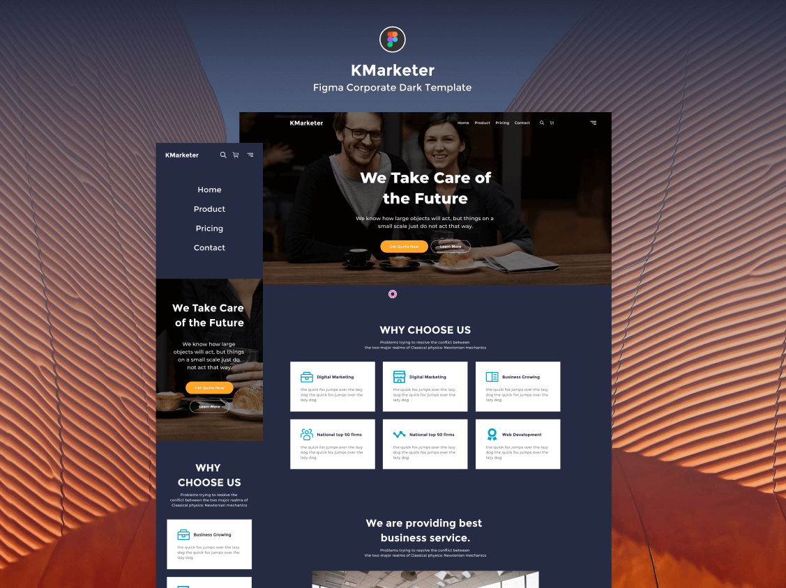

# Responsive Landing Page
This is a responsive site, which was made using htm5, css3, js, jquery and animate.css

the page was made perfectly like a design file, which I found on figma. (pixel perfect)

[Demo](https://andrewcrescencio.github.io/ResponsiveLandingPage/)

### note:
i don't know why but on github pages i'm getting an error that doesn't load the card images in the witness section
